## `CR` Problem and Eslint bug

```
npm  run  lint --fix

//vue.config.js
const { defineConfig } = require('@vue/cli-service');
module.exports = defineConfig({
  transpileDependencies: true,
  lintOnSave: false,
});


```

## Vue

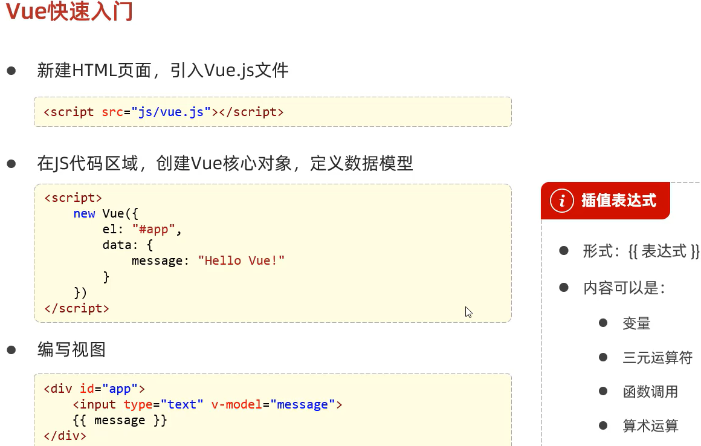

### Vue 常见指令

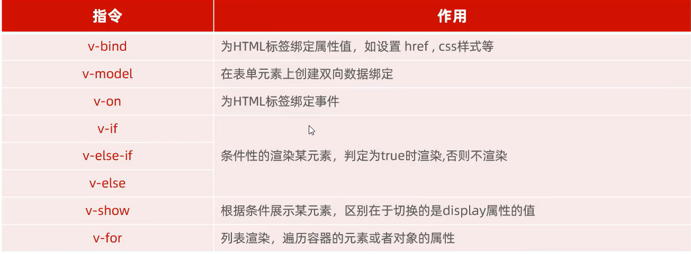

#### v-bind v-model v-on

```
<div class="app" id="app">
    <h1>{{message}}</h1>
    <!-- v-bind:为HTML标签绑定属性值,href,css样式等。简写 : -->
    <a v-bind:href="url">Click</a><br /><br />
    <!-- v-model:在表单元素上创建双向数据绑定 -->
    <input type="text" v-model="url" /><br /><br />
    <!-- v-on:为标签绑定事件 简写: @ 如@click -->
    <input type="button" value="按钮" v-on:click="handle()" />
</div>
<script src="./vue.js"></script>
<script>
    new Vue({
    el: "#app",
    data: {
        message: "Hello, Vue.js!",
        url: "https://bilibili.com",
    },
    methods: {
        handle: function () {
        alert("Clicked!");
        },
    },
    });
</script>
```

#### v-if v-show

```
<div class="app" id="app">
    <!-- v-if 判断为true渲染 -->
    <p v-if="age < 20">age&lt;20</p>
    <p v-else-if="age == 20">age=20</p>
    <p v-else>v-else</p>

    <!-- v-show 元素始终会被渲染，只是简单地切换 CSS 类 display -->
    <p v-show="age < 20">age&lt;20</p>
    <p v-show="age == 20">age=20</p>
    <p v-show="age > 20">v-show</p>
</div>
<script src="./vue.js"></script>
<script>
    new Vue({
    el: "#app",
    data: {
        age: 33,
    },
    methods: {},
    });
</script>
```

#### v-for

```
<div class="app" id="app">
    <div v-for="item in subject">{{item}}</div>
    <div v-for="(item,itemIndex) in subject">
    subject[{{itemIndex}}] =&gt; {{item}}
    </div>
</div>
<script src="./vue.js"></script>
<script>
    new Vue({
    el: "#app",
    data: {
        subject: ["Java", "JavaScript", "Ktolin"],
    },
    });
</script>
```

### Vue 生命周期

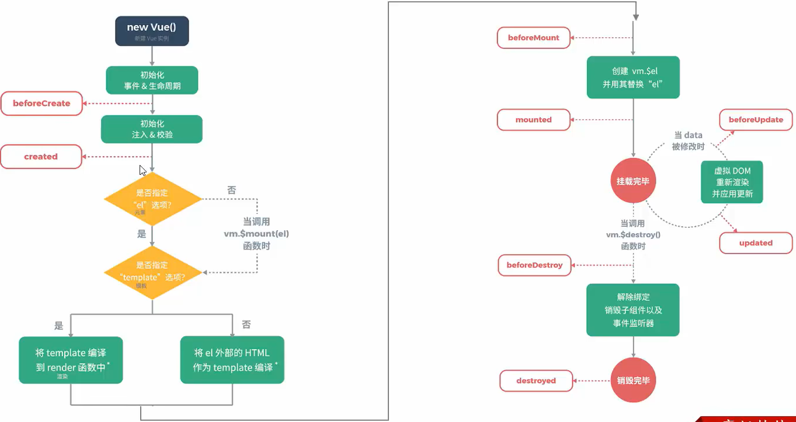

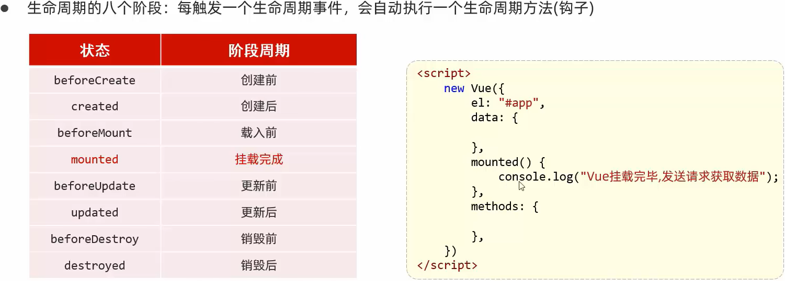

### vue-router

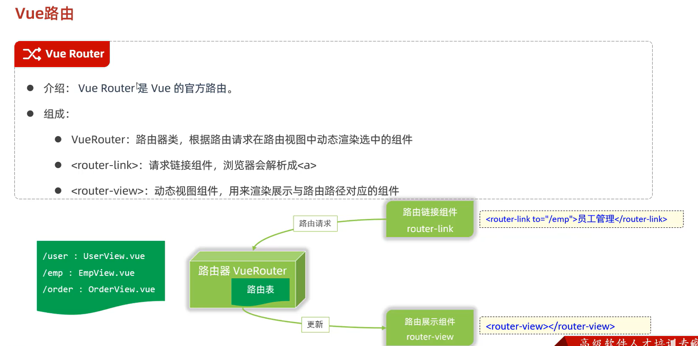

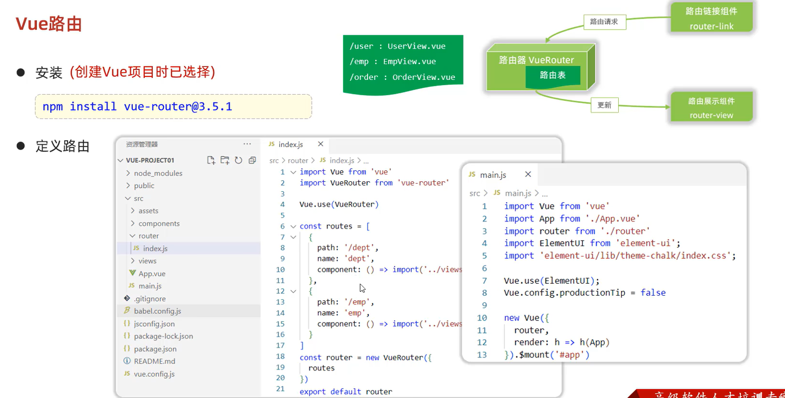
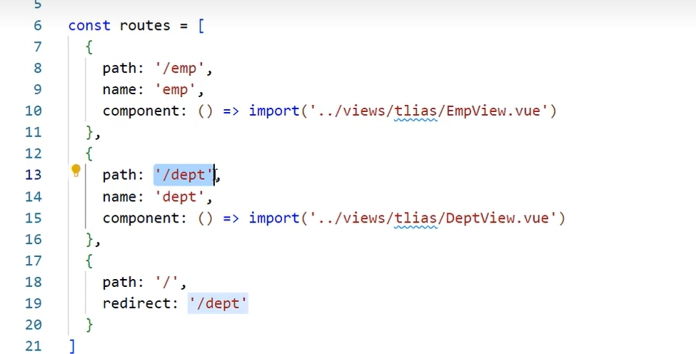

### Nginx 打包部署

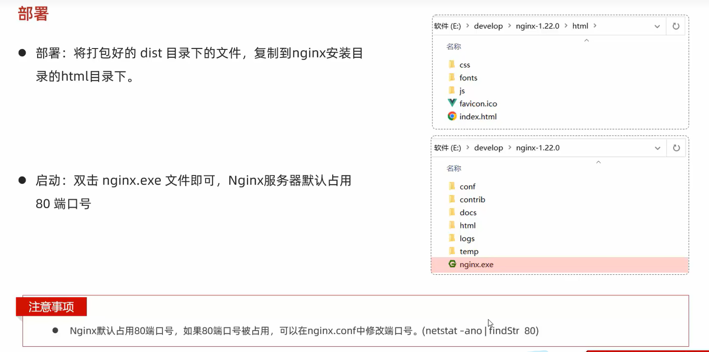

## Ajax Axios

### Ajax

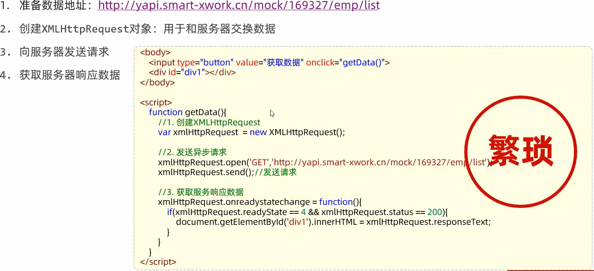

### Axios

对原生的 ajax 进行了封装

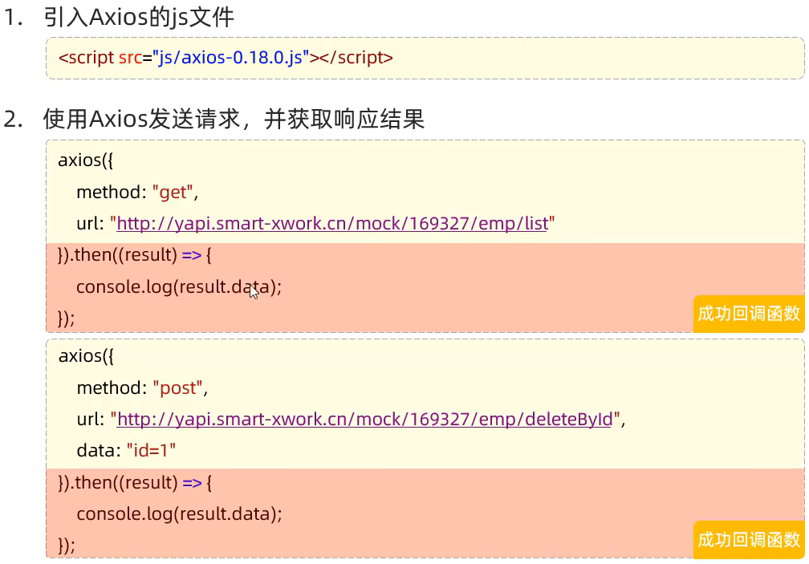

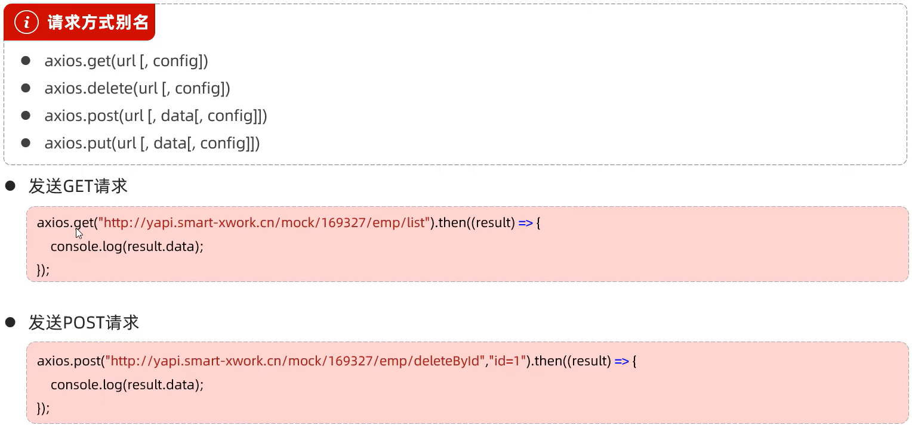

## YAPI 前端 API 管理

https://yapi.pro/group/362048

## 前端工程化

Vue-cli

```
vue create hellovue
vue ui

npm run serve
devServer{
    port:9999,
}
```

### Vue 文件

一个 vue 文件由 template,script,style 组成,是能够复用的组件

## Element-UI

Vue 2.x 的 UI 框架

```
npm install element-ui@2.15.3

import ElementUI from 'element-ui'
import 'element-ui/lib/theme-chalk/index.css';
Vue.use(ElementUI);
```

/Views/element/ElementView.vue

```
<template>
  <div>
    <el-button type="primary">按钮</el-button>
  </div>
</template>

<script>
export default {};
</script>

<style></style>
```

./App.vue

```
<template>
  <div id="app">
    <element-view></element-view>
  </div>
</template>
```

### Pagination

```
<el-pagination
    background
    layout="sizes,prev,pager,next,jumper,total,"
    :total="1000"
></el-pagination>
```

### Dialog

### slot 插槽

```
<el-table-column label="图像" width="180">
    <template slot-scope="scope">
    
    </template>
</el-table-column>
<el-form-item label="姓名" width="140">
    <template slot-scope="scope">{{
    (scope.row.gender = 1 ? "男" : "女")
    }}</template>
</el-form-item>
```

### 处理 aside 边线

```
<el-aside style="border:1px solid #eee"></el-aside>
```

### Form / Dialog-Form
