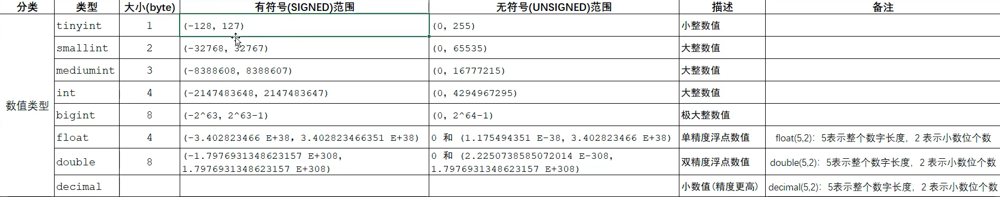
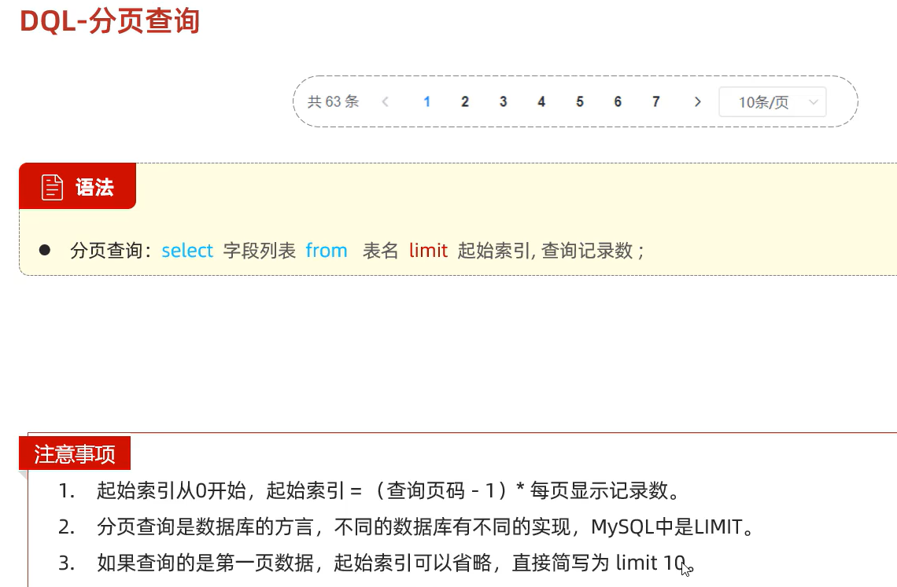
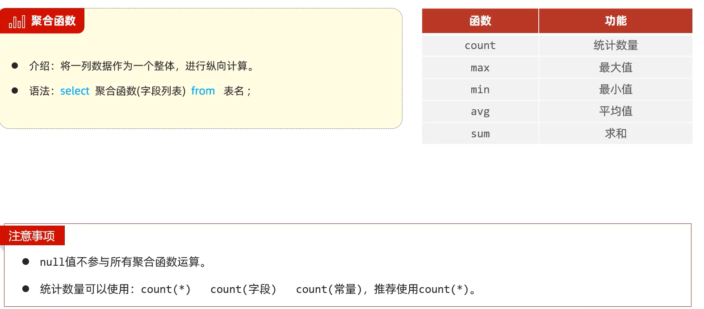
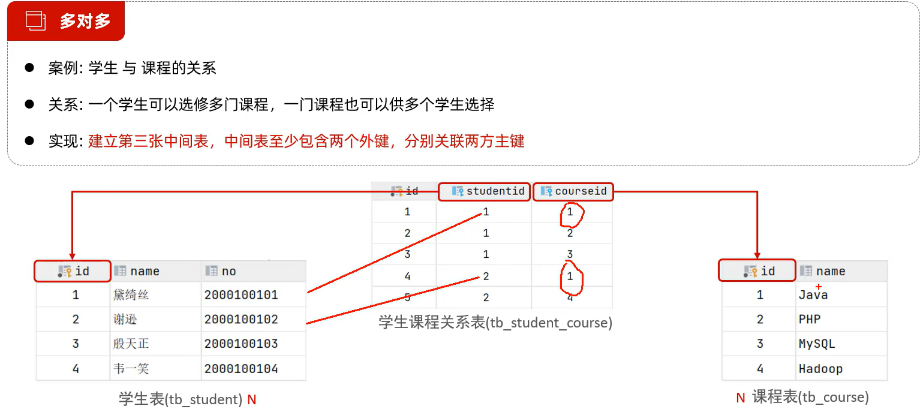

# Mysql

```
mysql -u root -proot
mysql -h192...101 -P3306 -u root -proot
```

基于二维表来存储的数据库被称为关系型数据库

DBMS


## 常见数据类型

```
数值类型
tinyint unsigned smallint mediumint
int bigint float double(5,2) decimal
字符类型
char varchar tinyblob tinytext blob
text mediumblob mediumtext longblob longtext

phone char(11)
username(varchar(20))
日期类型
date time year datetime timestamp

birthday date
update_time datetime
```




## DDL

```
//database可以换成schema
show databases;
create database if not exists db01;
use db01;
select database();//当前正在使用的数据库
drop database if exists db01;

create table tableName(
    field1 fieldType [约束] [comment field1Comment],
    id int primary key auto_increment,
    name varchar(10) not null unique,
    gender char(1) default "男"
)[comment 表注释]

表操作
show tables;
desc tableName;
show create table tb_emp;//查看建表语句

修改
修改字段：alter table user add 字段名 类型 [comment "xx"] [约束];
修改字段类型:alter table user modify 字段名 新数据类型;
修改字段名和字段类型:alter table 表名 change 旧字段名 新字段名 类型[comment "xx"] [约束];
删除字段：alter table user drop column 字段名;
修改表名:rename table user to New_user;
```

## DML

data manipulate ..

### INSERT


### UPDATE


### DELETE

delete from user where id=1;

## DQL

data query ...


### 基本查询


### 条件查询


### 分组查询


### 分页 limit 查询



### 聚合函数



## 约束


## 多表设计

一对多 多对多 一对一

### 一对多


这样的表虽然添加了 dept_id，但只是逻辑上有了联系，要让数据库层面有联系，应该用外键来约束


逻辑外键：不加外键约束，用代码实现逻辑上的外键

### 一对一


### 多对多



### 多表查询

#### 内连接

A 和 B 的交集


#### 外连接

A B 交集和一个 A 或 B 满足条件的集合


#### 子查询


## 事务

```
start transiction / begin
commit
rollback          //一旦执行错误，可以回滚数据
```

### 特性


## 索引

默认 B+Tree


