# 苍穹外卖


## 项目简介

web 端 + 小程序


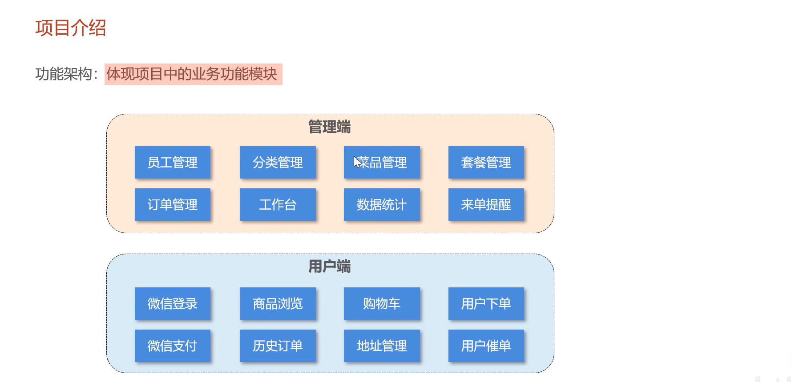

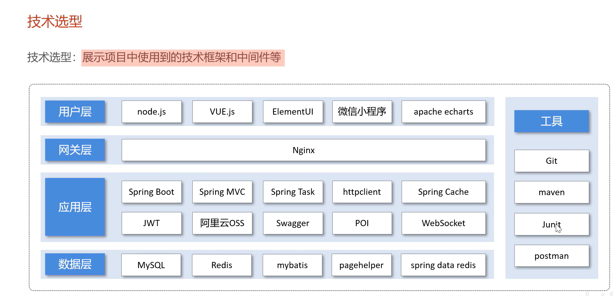

## 软件开发流程

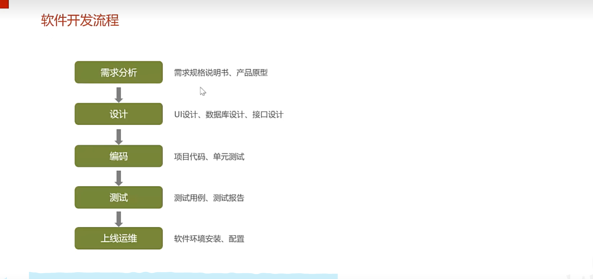


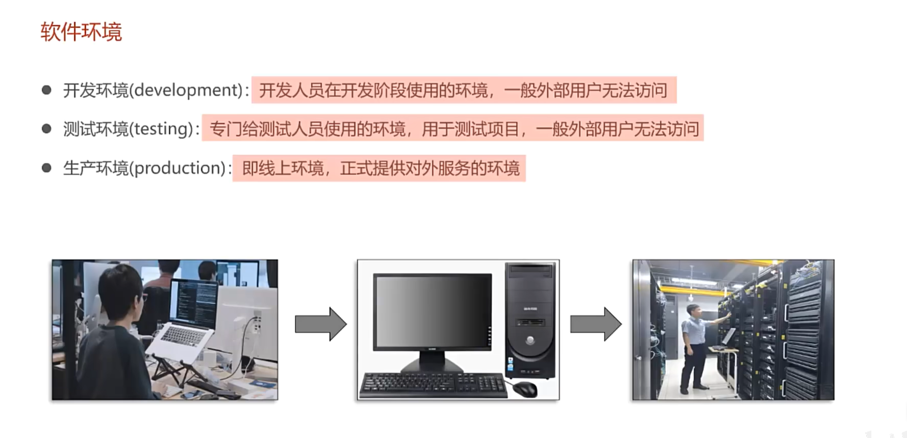

## 开发环境

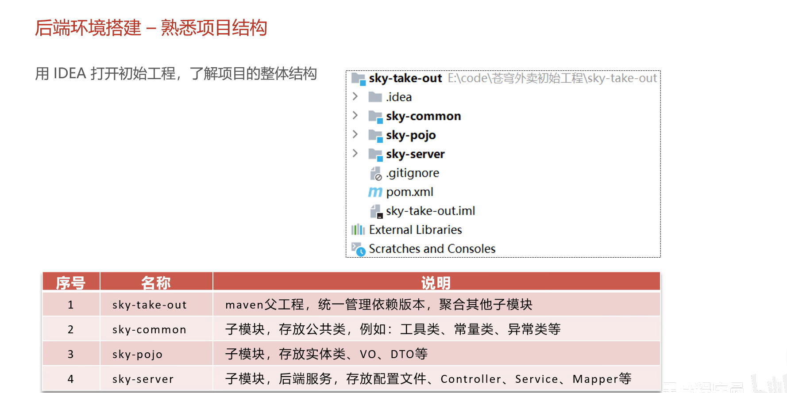
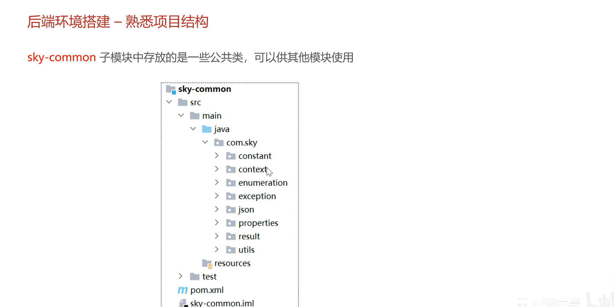


### Nginx 反向代理

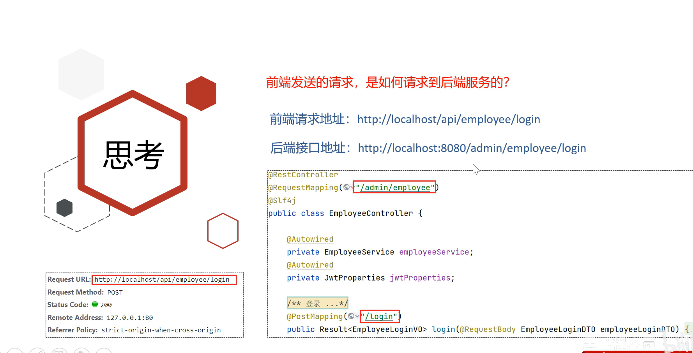

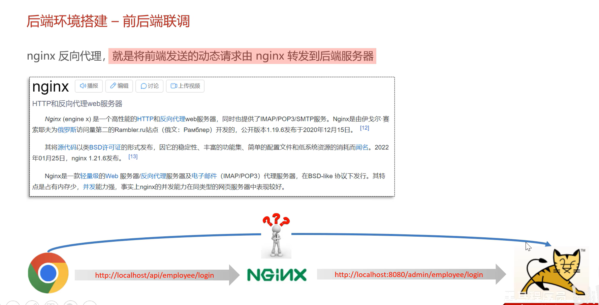

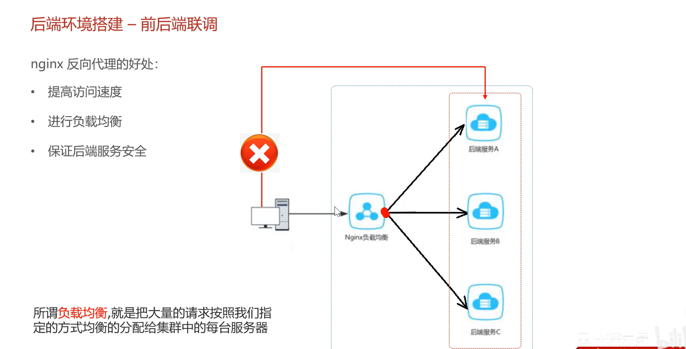

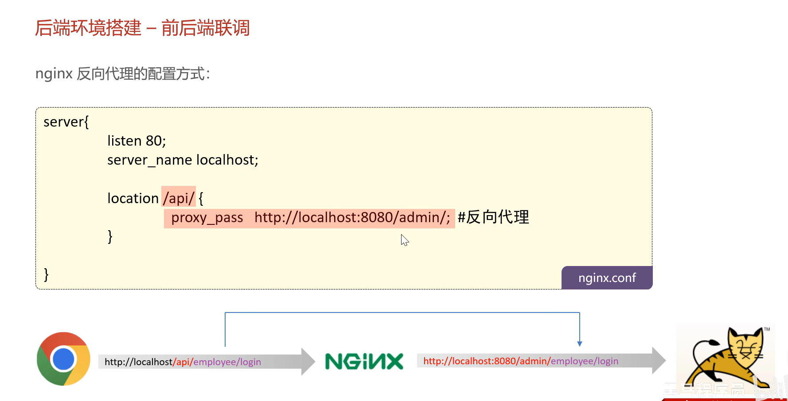


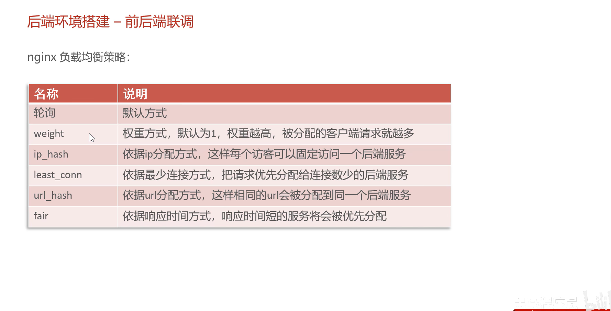

## 项目详解

### md5 加密密码

```
123456 => e10adc3949ba59abbe56e057f20f883e
password = DigestUtils.md5DigestAsHex(password.getBytes());
```

### Swagger 接口文档


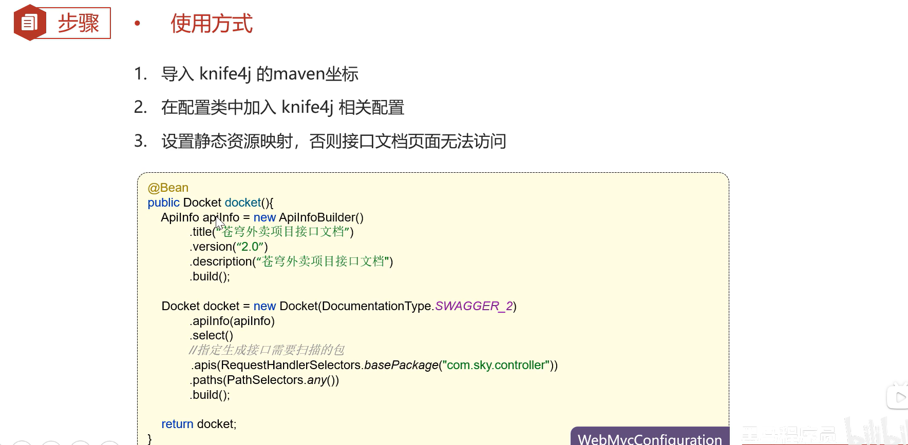
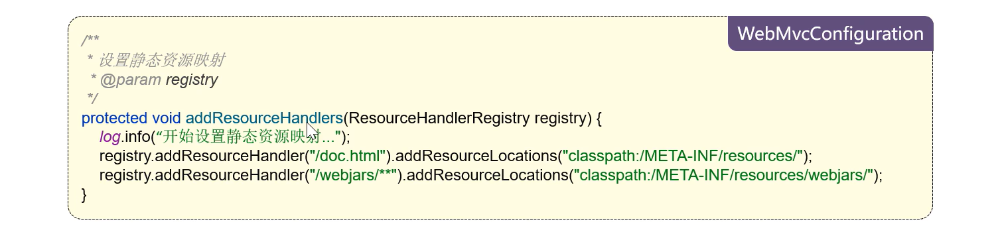
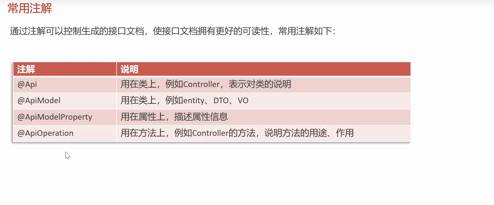

### JWT 流程

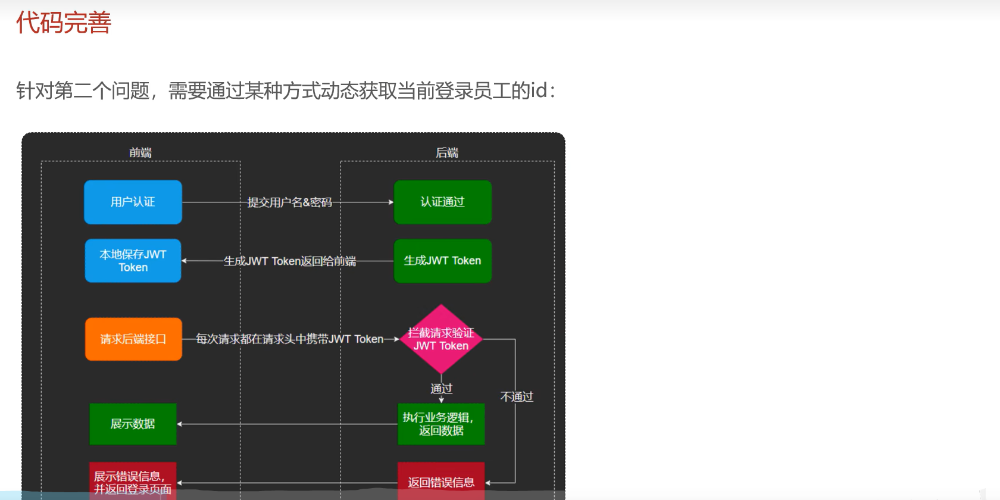

### 动态获取当前登录 id ThreadLocal

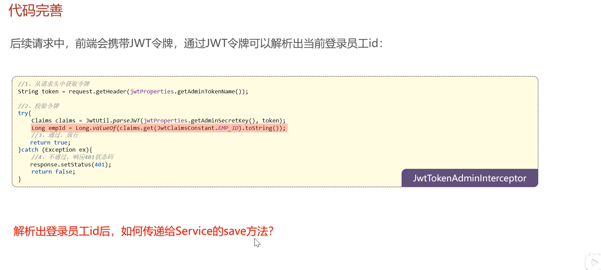

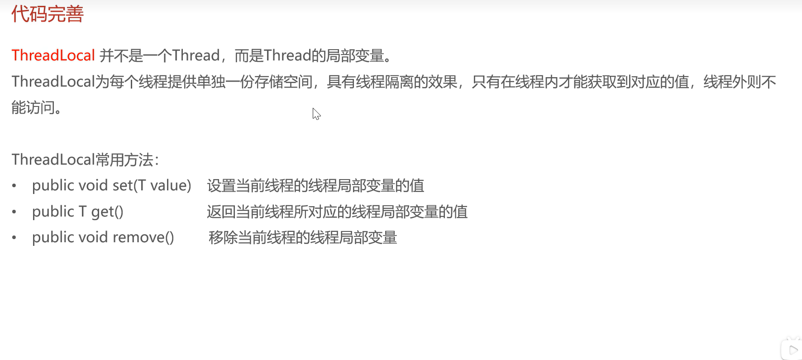

## 公共字段自动填充

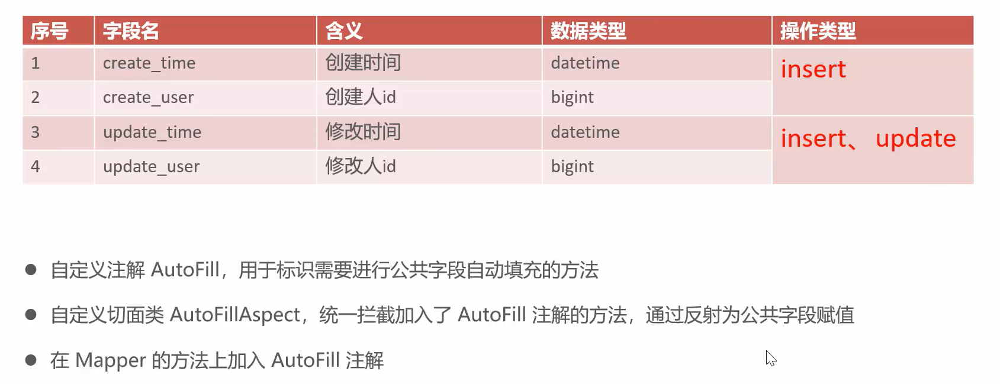

SK: bUkj8kCClqAgaDHEmlsFpRKPTaWmrR6D9YzSkirw
AK: r4yadKJUxFPPpAQeiC09wuVMkUcQ6LmBth4XDIcz
