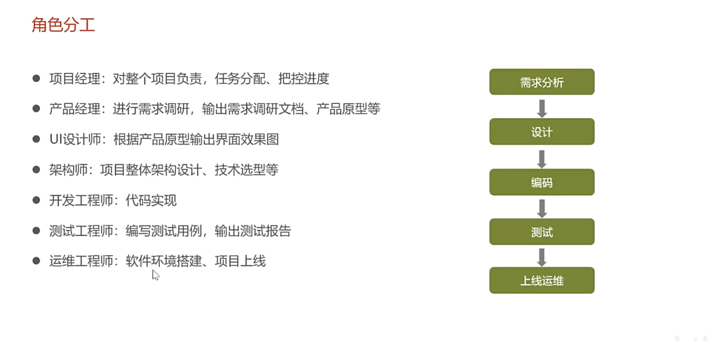
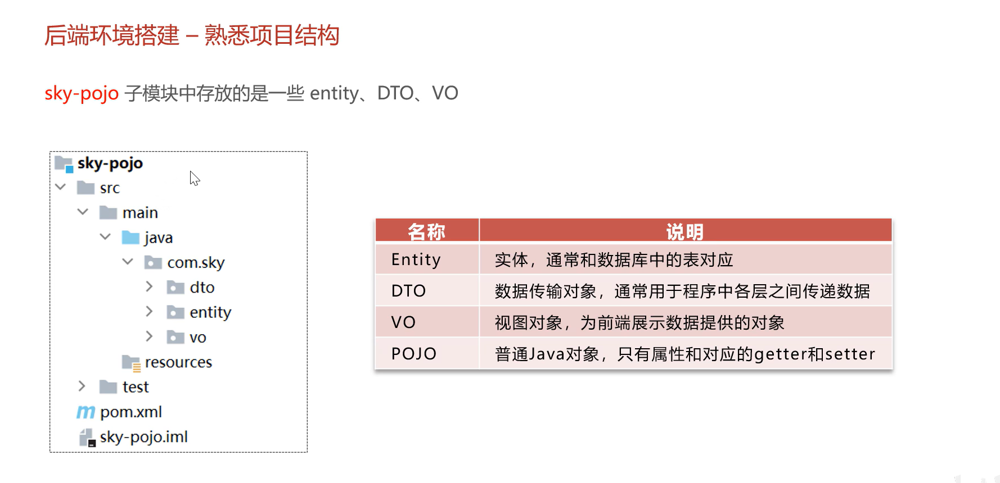
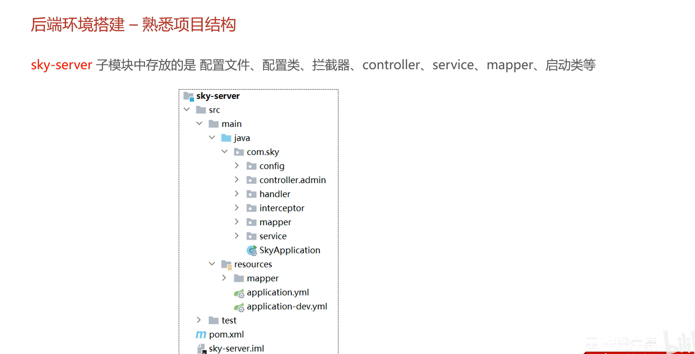
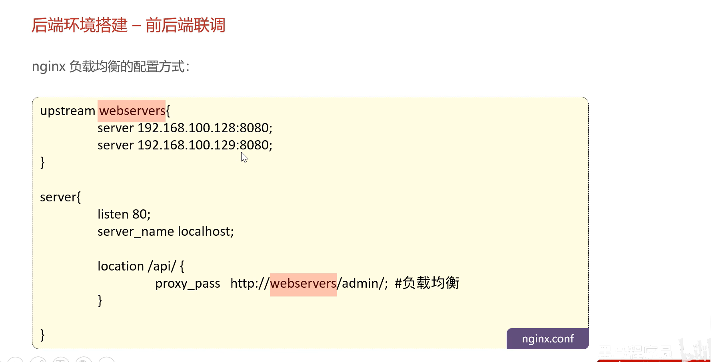
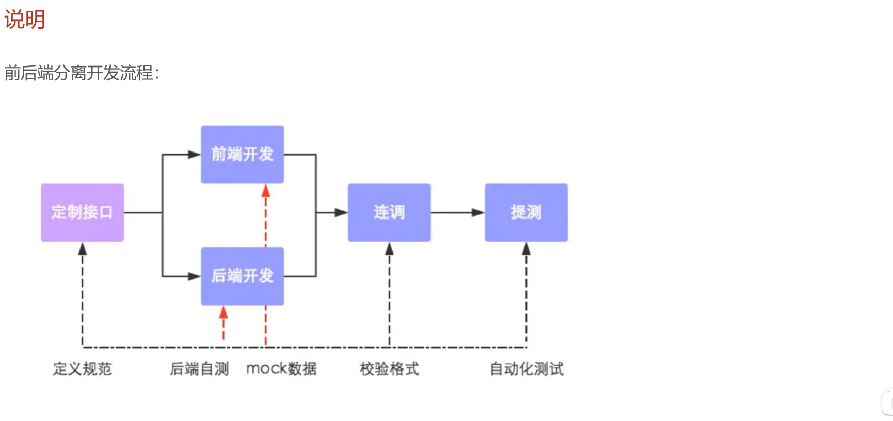
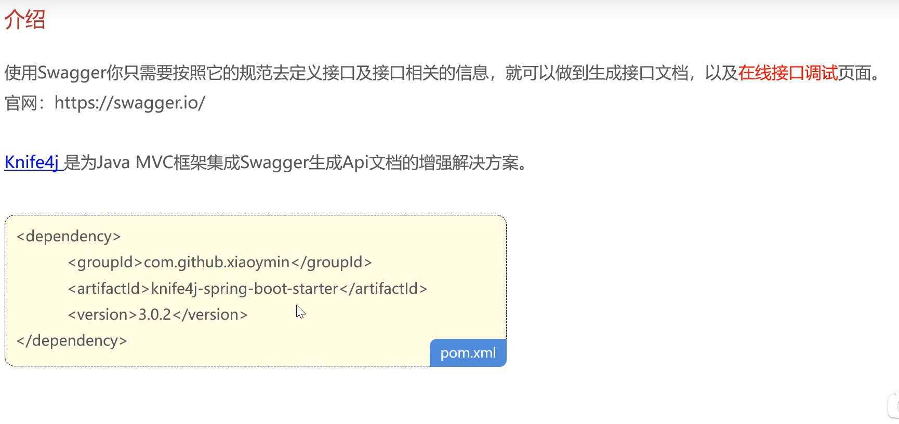

# 苍穹外卖


## 项目简介

web 端 + 小程序


## 软件开发流程





## 开发环境





### Nginx 反向代理





## 项目详解

### md5 加密密码

```
123456 => e10adc3949ba59abbe56e057f20f883e
password = DigestUtils.md5DigestAsHex(password.getBytes());
```

### Swagger 接口文档





### JWT 流程


### 动态获取当前登录 id ThreadLocal


## 公共字段自动填充


SK: bUkj8kCClqAgaDHEmlsFpRKPTaWmrR6D9YzSkirw
AK: r4yadKJUxFPPpAQeiC09wuVMkUcQ6LmBth4XDIcz
