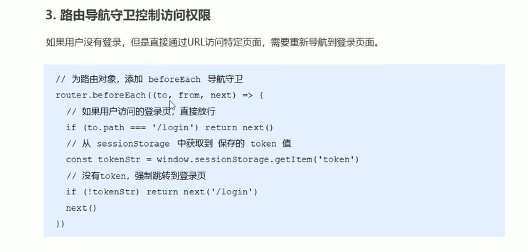

# router



```
// 挂载路由导航守卫
router.beforeEach((to, from, next) => {
	// to 将要访问的路径
	// from 从哪来的
	// next() 放行
	// next('/login') 强制跳转
	if (to.path === '/login') {
		return next();
	}
	const tokenStr = window.sessionStorage.getItem('token');
	if (!tokenStr) {
		// 未登录 | 没token 跳转登录
		return next('/login');
	}
	next();
});

// 编程式导航跳转
this.$router.push('/home');
```
