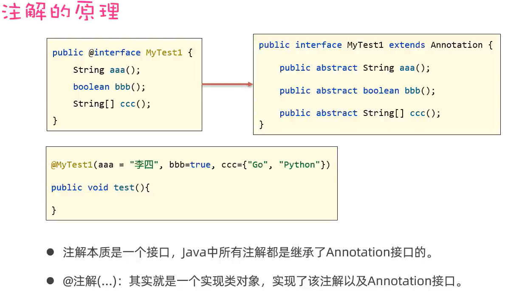

# JavaAdvanced

## 单元测试 Junit

单元测试：就是针对最小的功能单元（方法），编写测试代码对其进行正确性测试。

### Junit

IDEA 自带了 Junit

#### 使用

#### Junit 常见注解

## 反射

### 获取类的三种方法

### 获取类的构造器

### 获取类的成员变量

### 获取类的成员方法

### 作用 应用场景

## 注解

## 动态代理

Proxy
