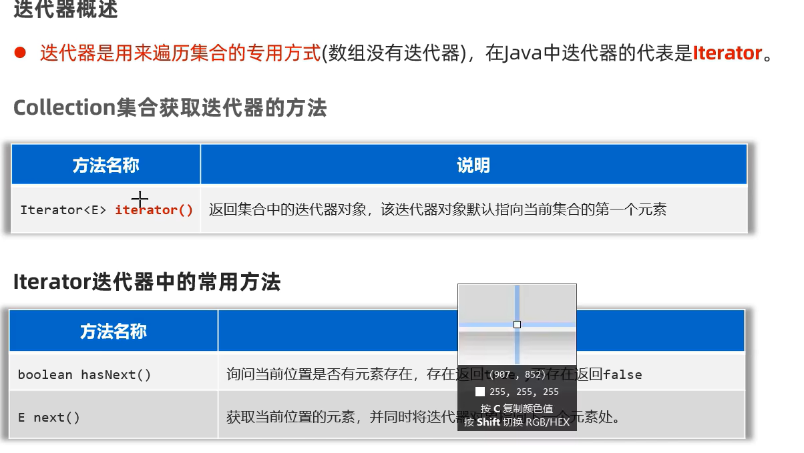

# JavaBasic

## String API


## ArrayList


## Enum


## Object


## StringBuilder


## StringBuffer


## StringJoiner


## Math


## System


```java
public class Main {
    public static void main(String[] args) {
//      1.  System.exit(0);//不要这样玩
//      2.  currentTimeMills: long -> 1970-1-1 0:0:0 1s=1000ms 可做性能测试
        long beforeLoop = System.currentTimeMillis();
        for (int i = 0; i < 1000000; i++) {
        }
        long afterLoop = System.currentTimeMillis();
        System.out.println((afterLoop - beforeLoop) / 1000.0 + "s");//0.002s
    }
}
```

## Runtime


## BigDecimal


## Date


## SimpleDateFormat


```java

    Date date = new Date();
    long timeMills = date.getTime();
    String formatDemo = "yyyy年MM月dd日 HH:mm:ss EEE a";
    SimpleDateFormat simpleDateFormat = new SimpleDateFormat(formatDemo);
    String finalTime1 = simpleDateFormat.format(timeMills);
    String finalTime2 = simpleDateFormat.format(date);
    System.out.println(finalTime1);//2024年07月13日 10:43:48 周六 上午
    System.out.println(finalTime2);

```


```java
String dataStr = "2022-12-12";
SimpleDateFormat sdf = new SimpleDateFormat("yyyy-MM-dd");
Date d2 = sdf.parse(dateStr);
```

## Calendar


```java
    Calendar now = Calendar.getInstance();
    now.add(Calendar.YEAR, 1);
    now.set(Calendar.DAY_OF_MONTH, 10);
```

## jdk8 之前的 DateError


newDate


#### LocalDate LocalTime LocalDateTime


#### LocalDate


#### LocalTime


#### ZoneId


#### Instant


#### DataTimeFormatter


```java
    DateTimeFormatter formatter = DateTimeFormatter.ofPattern("yyyy年MM月dd日");

    LocalDateTime now = LocalDateTime.now();
    String rs = formatter.format(now);//正向格式化

    System.out.println(now);//2024-07-13T11:40:56.861149700
    System.out.println(rs);//2024年07月13日

    String rs2 = now.format(formatter);//反向格式化
    System.out.println(rs2);//2024年07月13日


    DateTimeFormatter formatter2 = DateTimeFormatter.ofPattern("yyyy年MM月dd日 HH:mm:ss");
    String dateStr = "2024年07月13日 12:12:11";
    LocalDateTime ldt = LocalDateTime.parse(dateStr, formatter2);
    System.out.println(ldt);
```

#### Period


#### Duration


#### Duration period 作用


## Arrays


### arrays compare

方法一：


方法二：


## Lambda


## Function Ref 方法引用


静态方法的引用


实例方法的引用


特定类型方法的引用


构造器的引用


## 排序

### 冒泡排序

```java
    public static void main(String[] args) {
        int[] arr = {5, 2, 3, 1};
        for (int i = 0; i < arr.length - 1; i++) {
            for (int j = 0; j < arr.length - i - 1; j++) {
                if (arr[j] > arr[j + 1]) {
                    int temp = arr[j];
                    arr[j] = arr[j + 1];
                    arr[j + 1] = temp;
                }
            }
        }
        for (int i = 0; i < arr.length; i++) {
            System.out.println(arr[i]);//1235
        }
    }
```

### 选择排序


## 二分查找


## Regex


## 异常 Exception


## 集合 Collection Map

### 集合分类


### collection 分类


#### collection 方法


#### collection 遍历方法



##### lambda 遍历

```java
collectionDemo.forEach(System.out::println);
```

##### 增强 for 循环


##### Iterator hasNext()


#### List


##### list 遍历


#### ArrayList 底层原理


#### LinkedList 底层原理


可用来设计栈和队列

#### Set


#### hashValue 哈希值


#### hashSet 底层原理


#### LinkedHashSet 底层原理


#### TreeSet


#### 可变参数


#### Collections 静态方法


### Map 集合


#### Map 常见方法


#### Map 遍历


##### For 键找值


##### 把键值对存为 entry 对象遍历


##### Lambda


##### hashMap 底层原理


## Stream

初体验：


### 使用步骤


### 如何获取流


### Stream 中间方法


## 文件操作 File IO

File


IO 流：读写文件数据/网络数据

### File


初体验


#### 常见方法


文件的创建删除等


文件遍历


#### 案例 fileSearch


### IO 流

IO 分类


IO 体系


### FileInputStream


#### 利用 read 方法一个字节一个字节的读


循环改造


#### 利用 read[byte[],offset,len] 方法以多个字节读


改造


性能优化了但读取汉字还是会乱码

#### 使用文件字节流一次性读完


问题：如果文件过大，则创建的字节数组也很大，可能造成内存溢出

这时可以用字符流来操作

而字节流更适合做数据的转移，如文件复制

### FileOutputStream


append = true -> 追加管道


#### 文件复制


#### Try-Catch-Finally 释放资源


#### Try-With-Resources 释放资源


### FileReader


#### 读的两种方式


### FileWriter


### 总结


### IO-缓冲流


#### BufferedInputStream


#### BufferedReader


#### BufferedWriter


### IO-转换流

出现原因：代码编码和被读文件编码不同，出现乱码

#### InputStreamReader


#### OutputStreamWriter


### IO-打印流


#### PrintStream


#### PrintWriter


#### 打印流应用-打印重定向 setOut(ps)


### IO-数据流


### IO-序列流


#### 不参与序列化 transient


#### 多个对象的序列化 -> ArrayList

### IO-框架


#### Commons-io


## 特殊文件 .properties xml logback

### properties


### xml


#### 解析 xml dom4j 框架


#### 使用程序拼接写入 xml


#### DTD Schema 文档 约束 xml (了解)

### 日志及框架


#### logback


## Thread 线程


### 继承 thread

创建方法一：


### 多线程注意事项:

1.启动线程必须是调用 start，而不是 run

2.不要把主线程任务放到子线程之前

### 实现 runnable 接口


匿名内部类写法


### 利用 Callable 接口 FutureTask 类

  
  


### 线程安全问题


#### 解决线程安全问题-线程同步


##### 同步代码块


静态方法：类名.Class

多账户： this


##### 同步方法


##### Lock 锁


### 线程通信


### 线程池


#### 线程池的创建


#### 新任务策略


#### Executors 工具类


##### Executors 陷阱


### 乐观锁 悲观锁

## 网络通信

### 两种架构 ： C/S B/S

### 网络通信三要素


#### IP 地址


#### InetAddress


#### Port 端口号


#### Protocol 协议

网络上通信的设备，事先规定的连接规则，以及传输数据的规则被称为网络通信协议


##### OSI


#### UDP 通信


#### DatagramSocket


##### 一发一收案例 客户端发一个 服务端收一个


##### 多发多收案例 客户端一直发 服务端一直收


#### TCP 通信


##### TCP 一对一 客户端发一个 服务端收一个


##### TCP 多对多 客户端一直发 服务端一直收


离线处理


##### TCP 支持与多个客户端同时通信 一个服务端 多个客户端


##### TCP 通过端口转发实现群聊 客户端对客户端


##### TCP 设计一个简单的 B/S Server


用线程池优化


### 配置多开

edit Configuration -> bulid and run -> modify options -> mutiple
