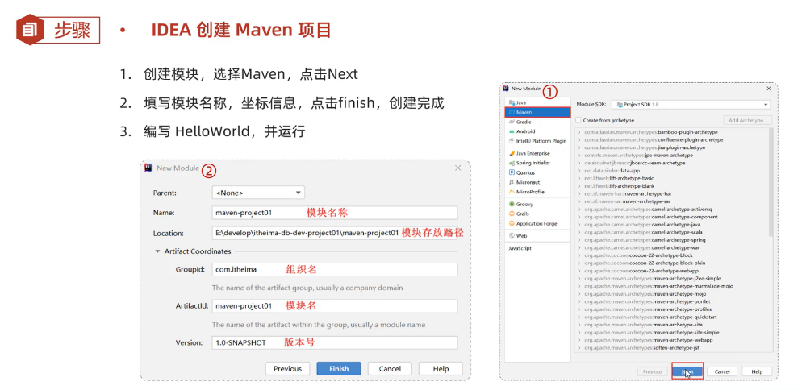
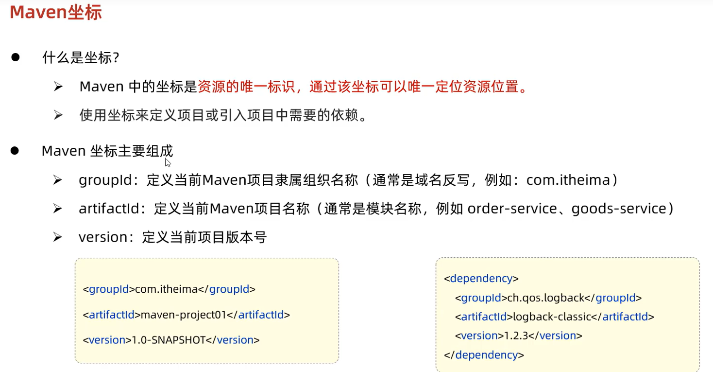
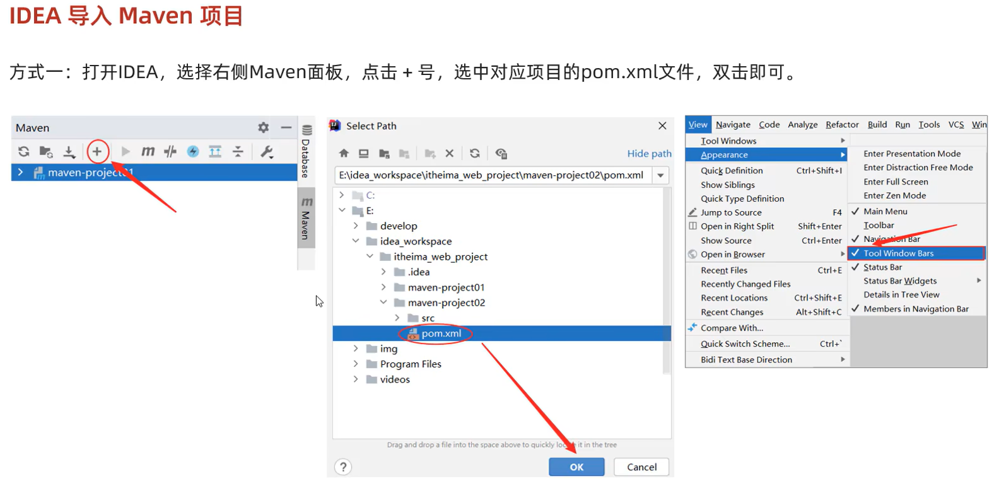
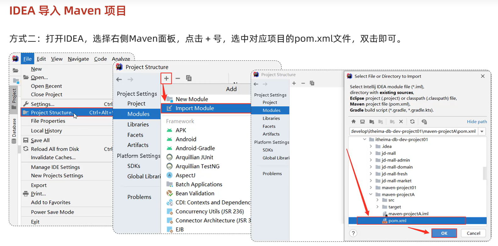
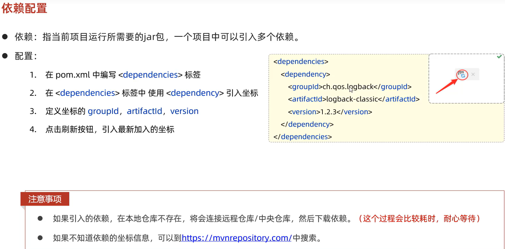
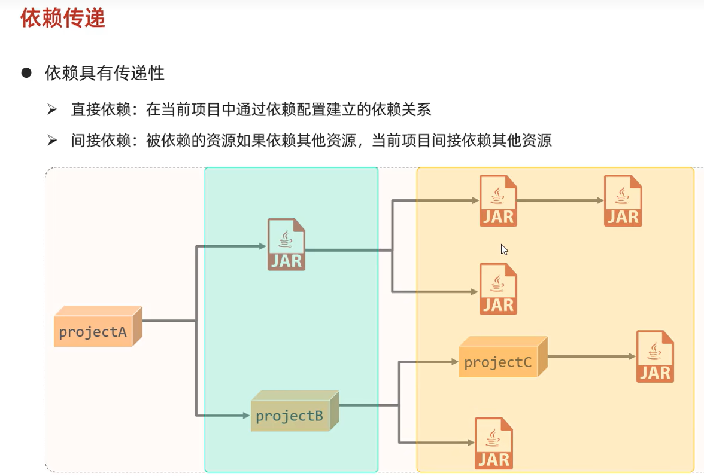
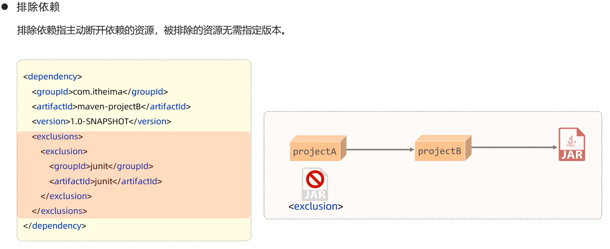
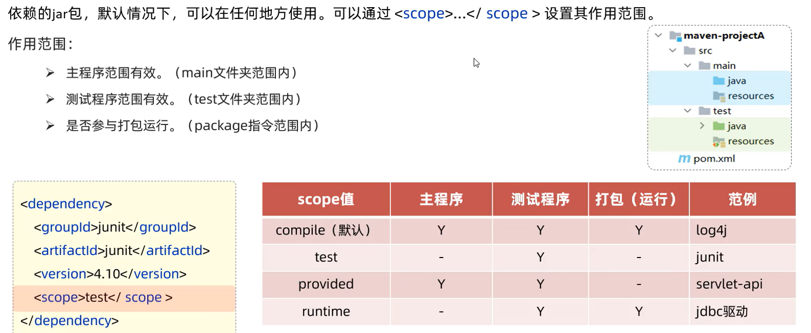
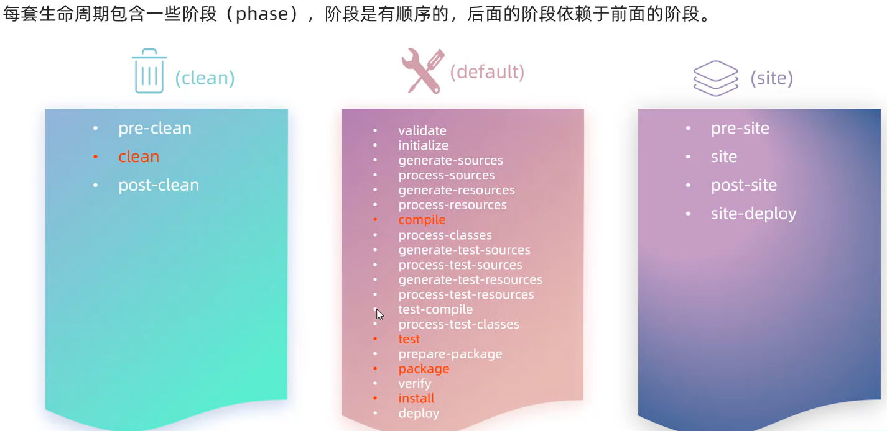
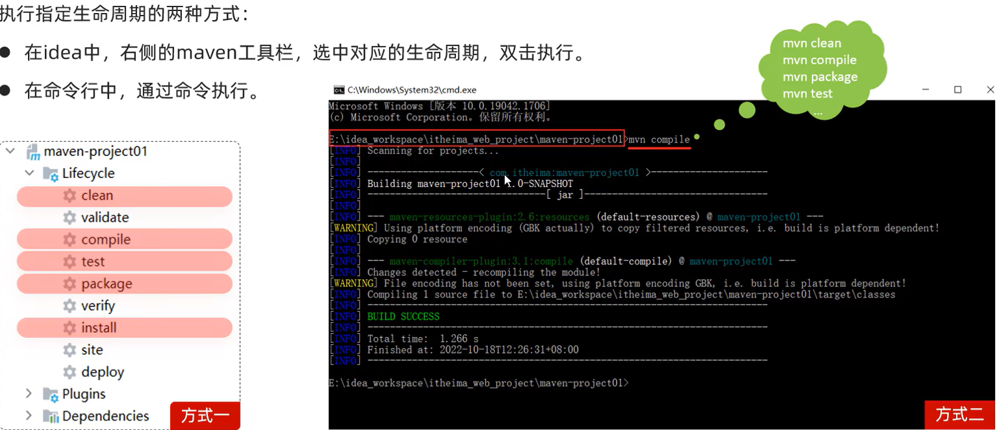

## Maven

```
环境变量 MAVEN_HOME \bin
setting.xml -> localRepo : ...  && mirror 阿里云镜像 alimaven
IDEA : -> maven_path,repo,setting  Runner -> 11 Java Compiler -> 11
```

### 创建 maven 项目




### maven 项目导入




### 依赖配置



### 依赖传递

右键 show diagram


### 排除依赖



### 依赖范围



### 生命周期



### 生命周期的执行

实际上是由 plugins 实现的

