# MyBatis

MyBatis 时持久层(dao)框架，用于简化 JDBC

## 初体验

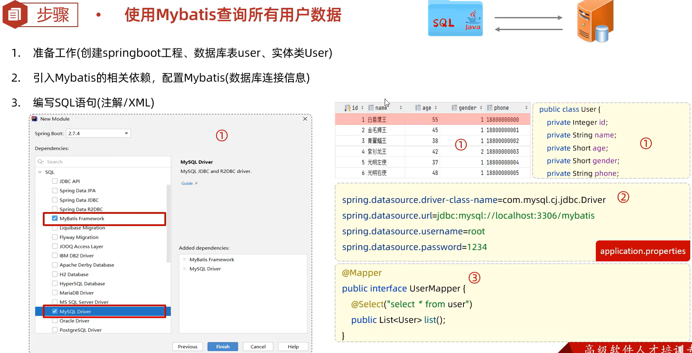

```
pojo.User:

    private Integer id;
    private String name;
    private String pwd;
    //setters and getters

.properties:

    spring.datasource.driver-class-name=com.mysql.cj.jdbc.Driver
    spring.datasource.url=jdbc:mysql://localhost:3306/mybatis
    spring.datasource.username=root
    spring.datasource.password=root

Test:

    @Autowired
    private UserMapper userMapper;

    @Test
    public void testListUser() {
        List<User> userList = userMapper.list();
        userList.stream().forEach(user -> {
            System.out.println(user);});
    }

mapper.UserMapper:

    @Mapper
    public interface UserMapper {
        @Select("SELECT * FROM user")
        public List<User> list();
    }

```

@Mapper //在运行时，会自动生成改接口的实现类对象（代理对象），并将该对象交给 IOC

## SQL 提示

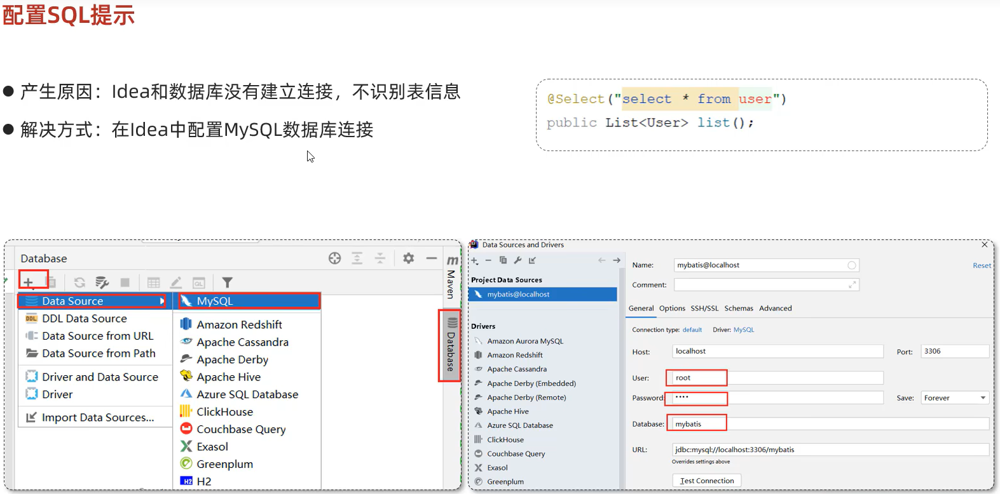
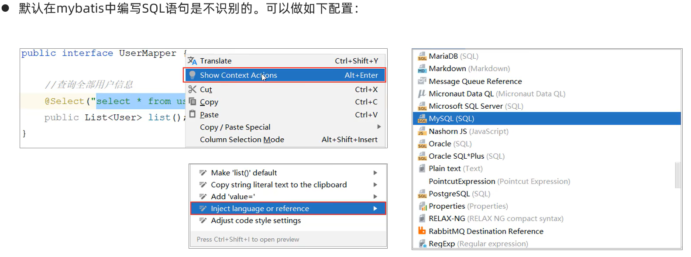

## JDBC

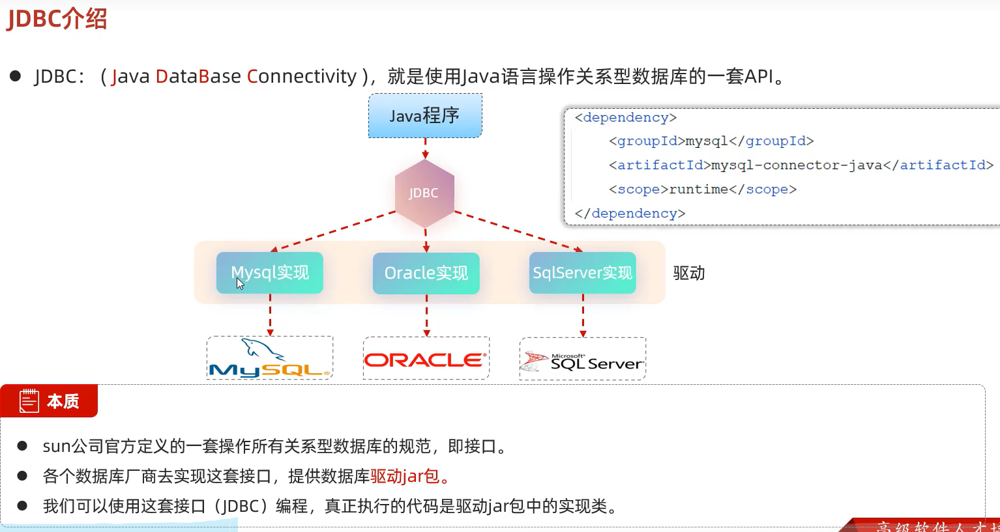
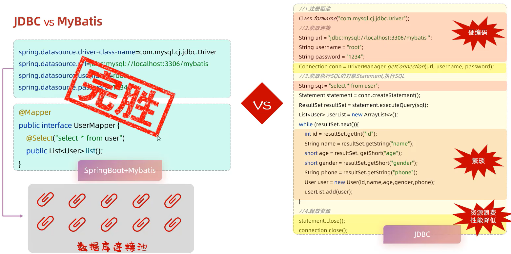

## 数据库连接池

```
标准接口：DataSource
功能：获取连接 Connection getConnection() throws SQLException

常见连接池：C3P0 DBCP Druid Hikari(SpringBoot Default)
Druid - ali开源 , 是Java最好的数据库连接池之一
```

### 切换数据库连接池

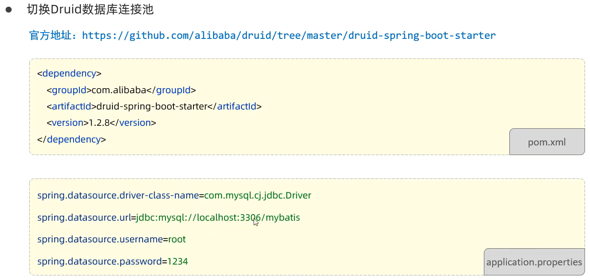

这里的 spring.datasource.(druid).url 中 druid 可以省略

## lombok

springboot start 中规定了 lombok 版本,所有这里无需指定版本
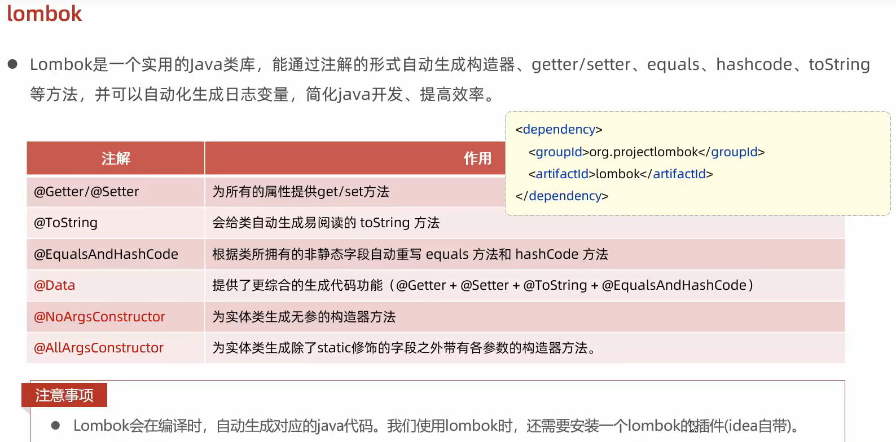

```
    <dependency>
        <groupId>org.projectlombok</groupId>
        <artifactId>lombok</artifactId>
    </dependency>

    @Data
    @NoArgsConstructor
    @AllArgsConstructor
    public class User {
        private Integer id;
        private String name;
        private String pwd;
    }
```

## MyBatis 增删改查

### 日志输出

```
.properties:

    mybatis.configuration.log-impl=org.apache.ibatis.logging.stdout.StdOutImpl

    //预编译：性能高 防止SQL注入
    Preparing: delete from emp where id = ?
    Parameters: 16 (Integer)
```

### 增

```
    @Insert("INSERT INTO user(name,age) VALUES(#{name},#{age})")
    public void insert(User user);

    //返回主键 (user.getId())
    @Options(keyProperty="id", useGeneratedKeys=true)
    @Insert("INSERT INTO user(name,age) VALUES(#{name},#{age})")
    public void insert(User user);

```

### 删

```
    //删除成功返回1 失败0    ${value} SQL拼接(不好)
    @Delete("DELETE FROM emp WHERE id = #{id}")
    public void delete(Integer id);
```

### 改

```
    @Update("UPDATE user SET name=#{name},age=#{age} WHERE id=#{id}")
    public void update(User user)
```

### 查

#### 根据 ID 查询回显

```
    @Select("SELECT * FROM user WHERE id=#{id}")
    public User getById(Integer id);
```

##### 数据封装问题

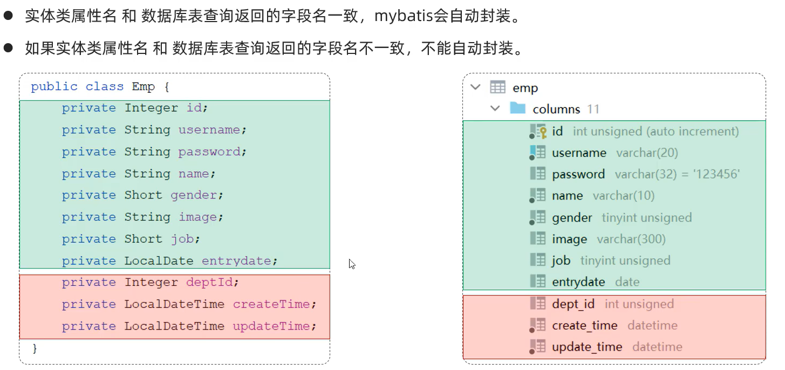

解决方法

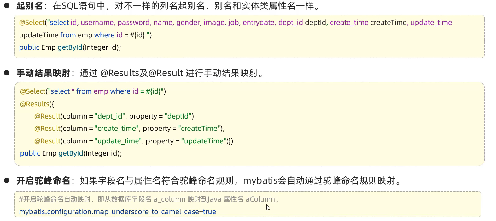

#### 根据条件查询

```
    //性能低 不安全 存在SQL注入风险
    @Select("SELECT * FROM user WHERE name LIKE '%${name}%' AND age=#{age}")

    //推荐concat
    @Select("SELECT * FROM user WHERE name LIKE concat('%',#{name},'%') AND age=#{age}")

    public List<User> list(String name,Integer age);
```

## MyBatis XML 映射文件

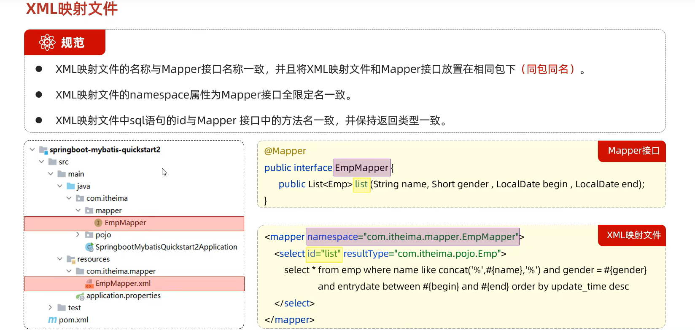

### MyBatisX Plugins

## 动态 SQL

### <if> <where> <set>

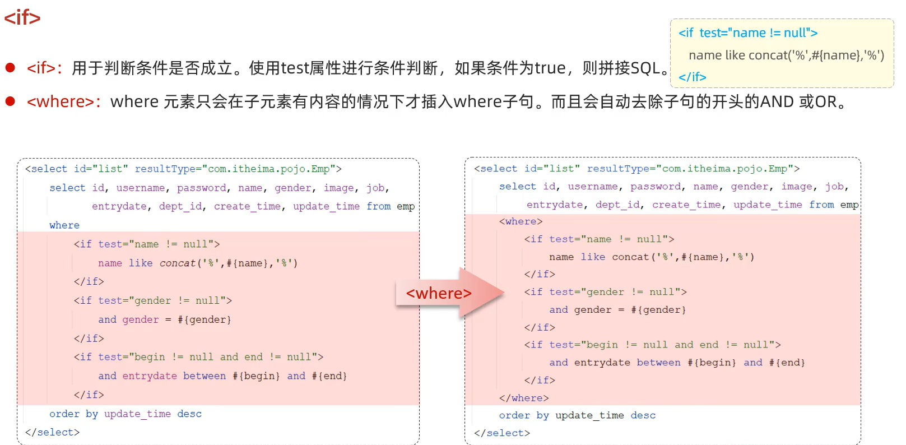

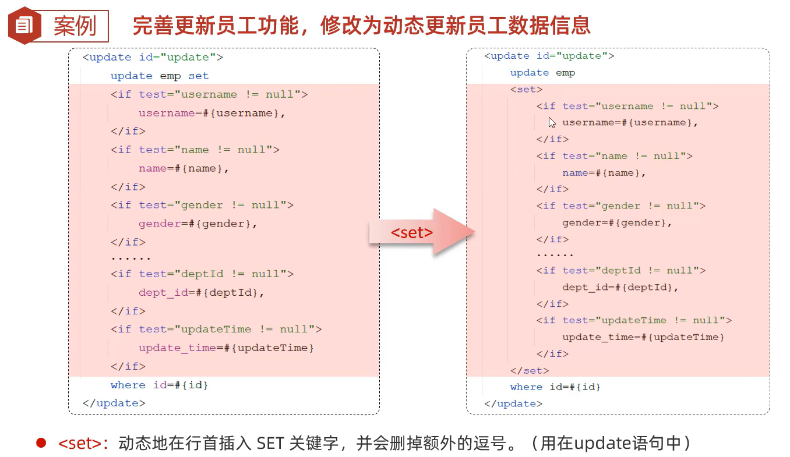

### <foreach>

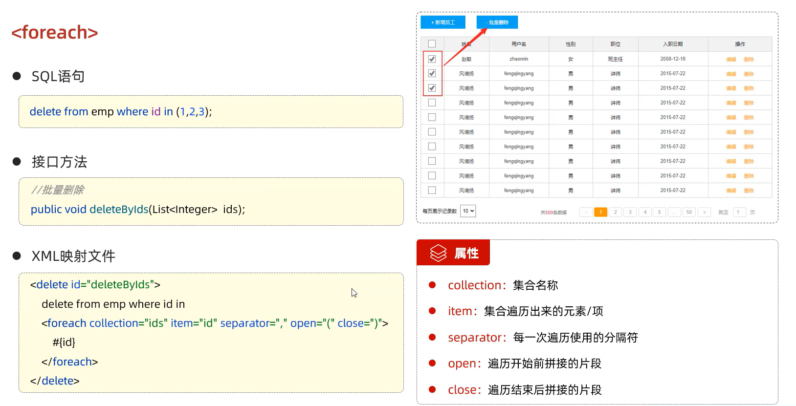

### <sql> <include>

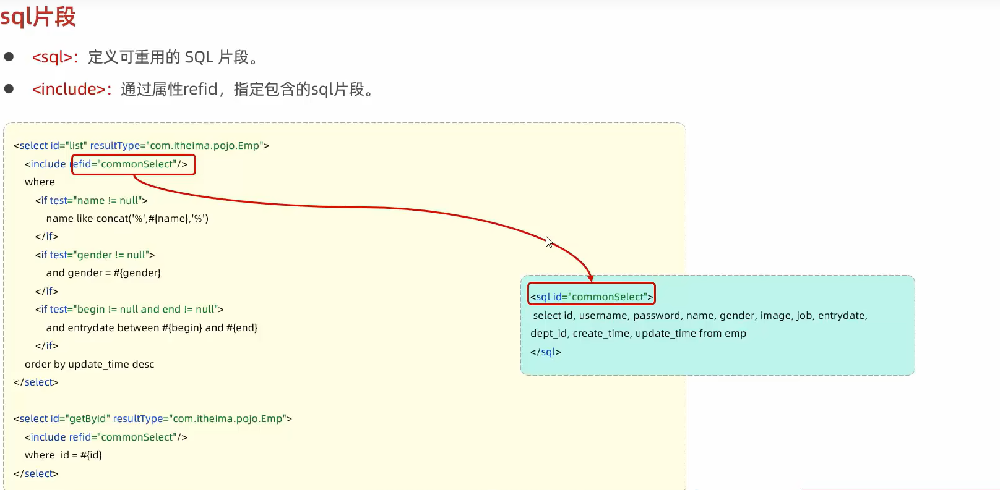

## PageHelper 插件 实现分页查询

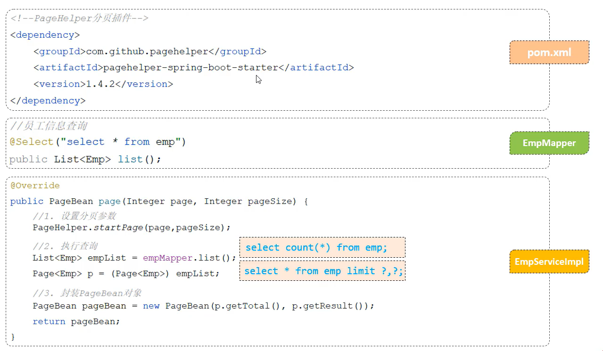

## 文件上传

前端文件上传三要素

```
<!DOCTYPE html>
<html lang="en">
  <head>
    <meta charset="UTF-8" />
    <meta name="viewport" content="width=device-width, initial-scale=1.0" />
    <title>uploadFile</title>
  </head>
  <body>
    <form action="/upload" method="post" enctype="multipart/form-data">
      姓名：<input type="text" name="username" /><br />
      年龄：<input type="text" name="age" /><br />
      头像：<input type="file" name="image" /><br />
      <input type="submit" value="提交" />
    </form>
  </body>
</html>


```

```
@PostMapping("/upload")
public Result upload(String username, Integer age, MultipartFile image) {
    log.info("文件上传:{} {} {}", username, age, image);
    return Result.success();
}
```

这样上传会产生 temp 文件，请求后 temp 文件自动删除了。

### 存储上传的文件

#### 本地存储

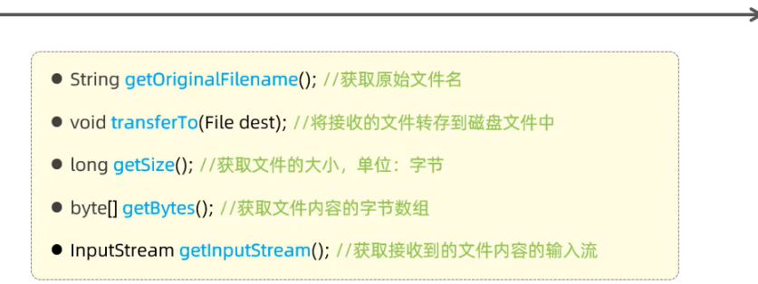

```
@PostMapping("/upload")
public Result upload(String username, Integer age, MultipartFile image) throws Exception {
    log.info("文件上传:{} {} {}", username, age, image);
    String originalFilename = image.getOriginalFilename();
    String newFileName = UUID.randomUUID()
            .toString() + originalFilename
            .substring(originalFilename
                    .lastIndexOf("."));
    image.transferTo(new File("E:/images/" + newFileName));
    return Result.success();
}
```

#### 配置文件上传大小

```
spring.servlet.mutipart.max-file-size=10MB
spring.servlet.mutipart.max-request-size=100MB
```

#### 阿里云 云服务 OSS 对象存储服务

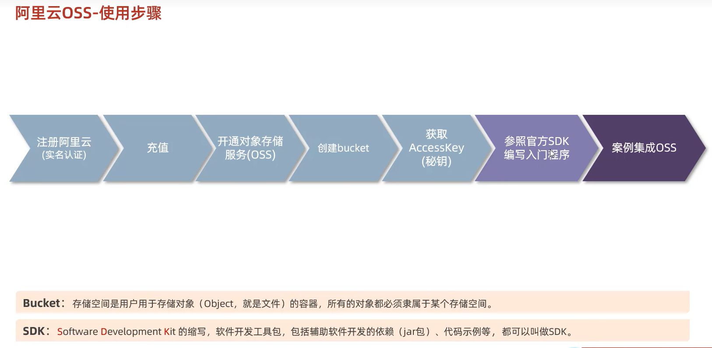

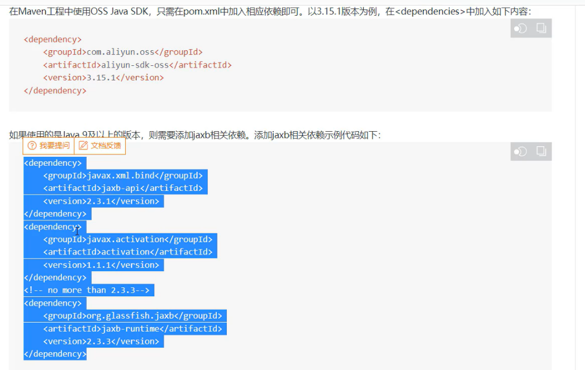

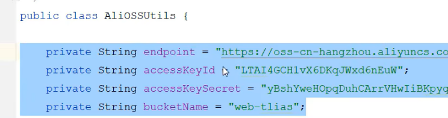
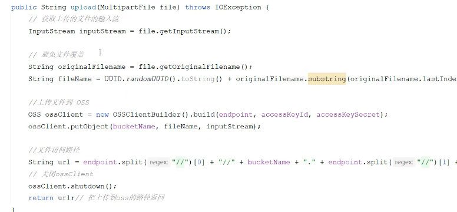

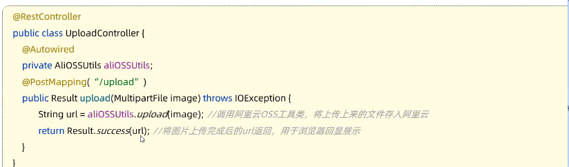

## 修改员工

### 查询回显

```
@Select("select * from emp where id=#{id}")
Emp getById(Integer id);

@GetMapping("/{id}")
public Result getById(@PathVariable Integer id) {
    log.info("\n\n当前查询 ID ==> {}\n\n", id);
    Emp emp = empService.getById(id);
    return Result.success(emp);
}
```

### 修改员工

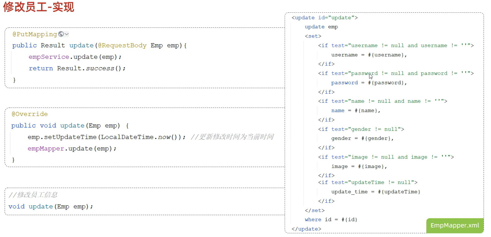
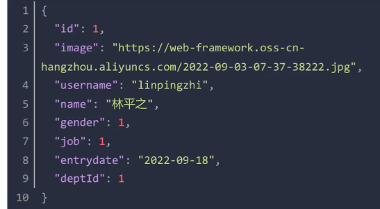

## properties 文件以及其他操作

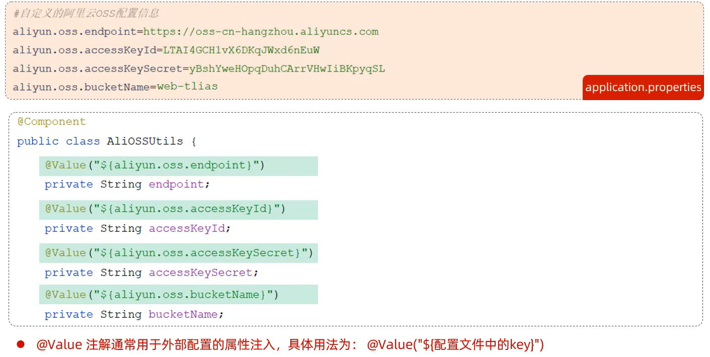

spring 提供了三种配置文件

```
application.properties
application.yml
application.yaml

xml:臃肿
properties:结构层次不清晰
yaml:简洁 结构清晰
```

### yaml 常见数据类型

```
对象/Map集合

user:
    name: Alex
    age: 33

数组/List/Set
hobby:
    -sing
    -dance
    -basketball
```

### @Config..

@Value 只能一个一个注入
@Config..批量注入
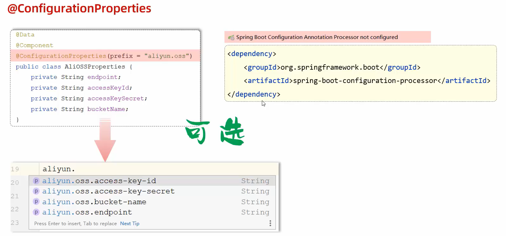
