# 苍穹外卖

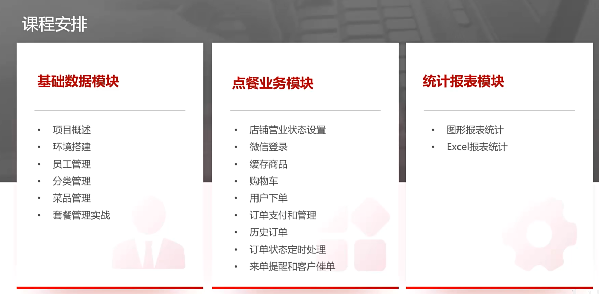

## 项目简介

web 端 + 小程序


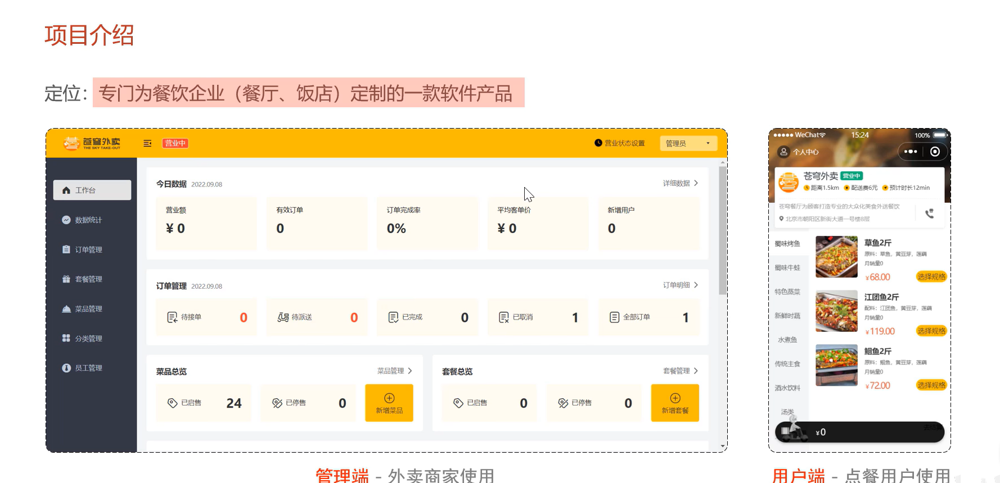

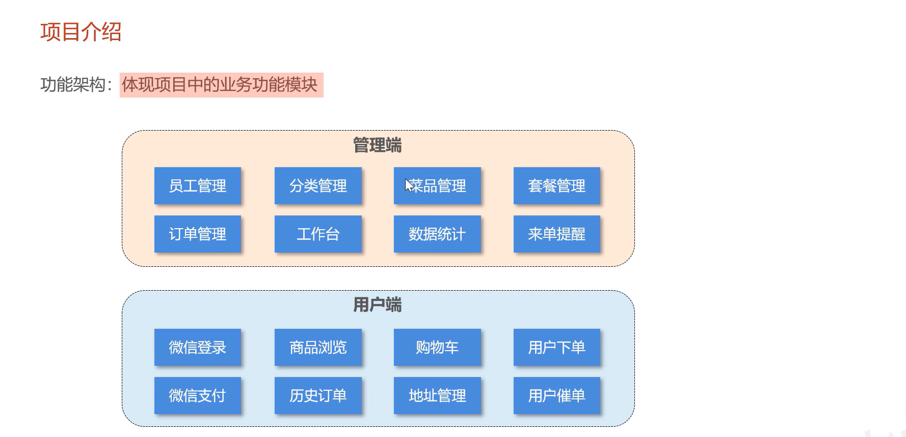


## 软件开发流程

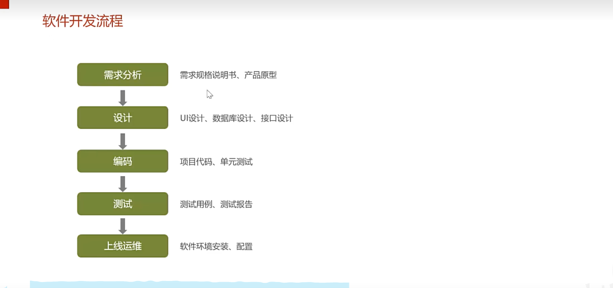


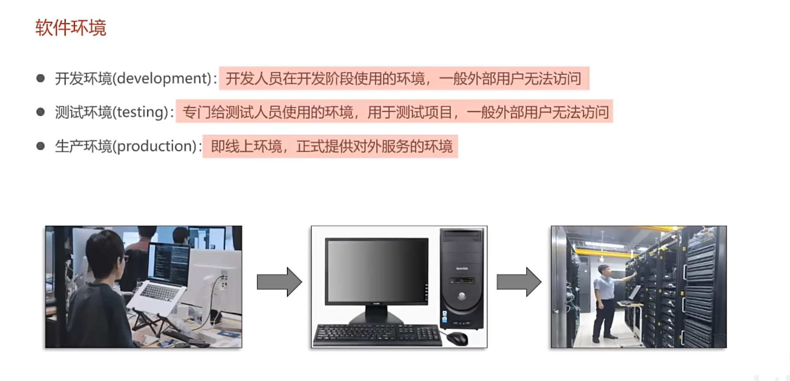

## 开发环境


### Nginx 反向代理

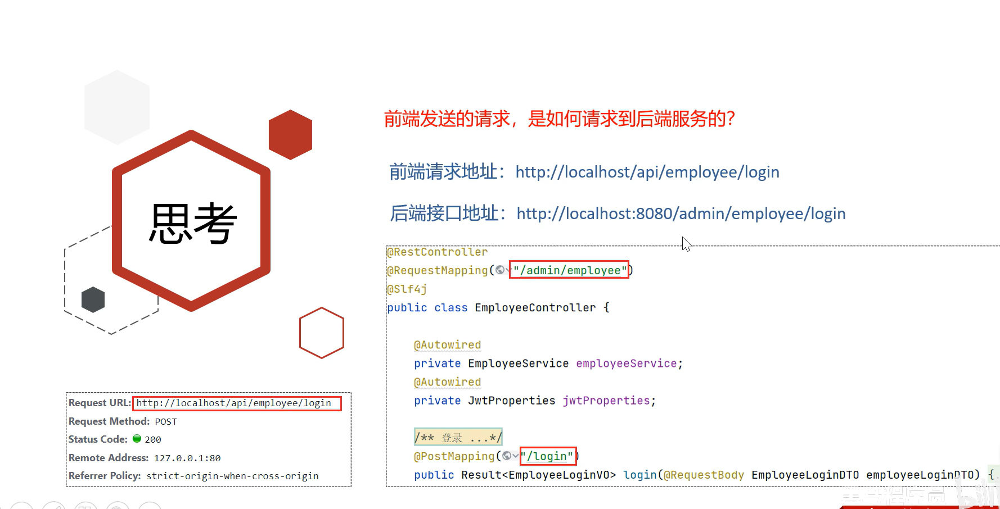


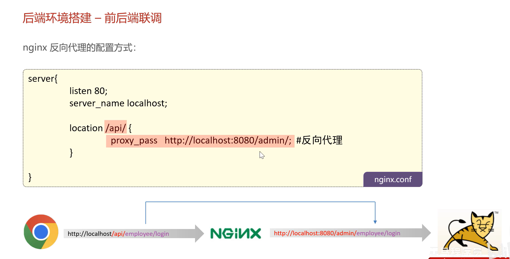


## 项目详解

### md5 加密密码

```
123456 => e10adc3949ba59abbe56e057f20f883e
password = DigestUtils.md5DigestAsHex(password.getBytes());
```

### Swagger 接口文档


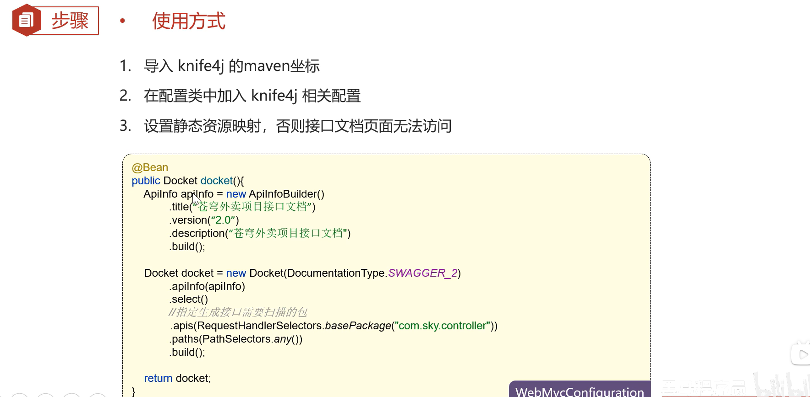


### JWT 流程

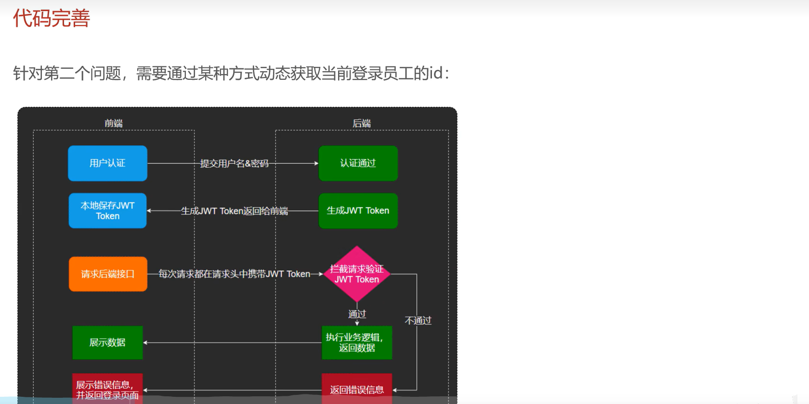

### 动态获取当前登录 id ThreadLocal

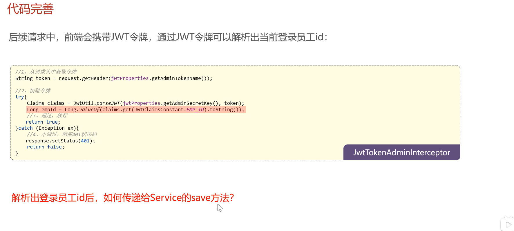

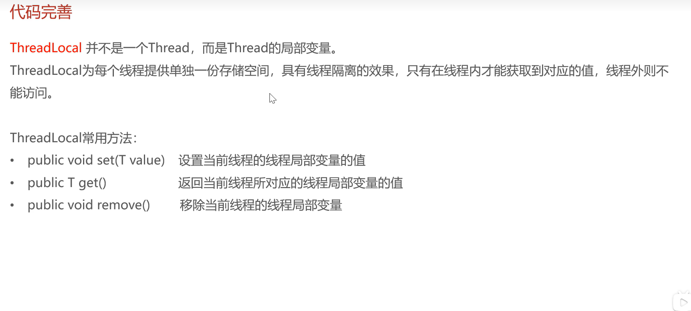
