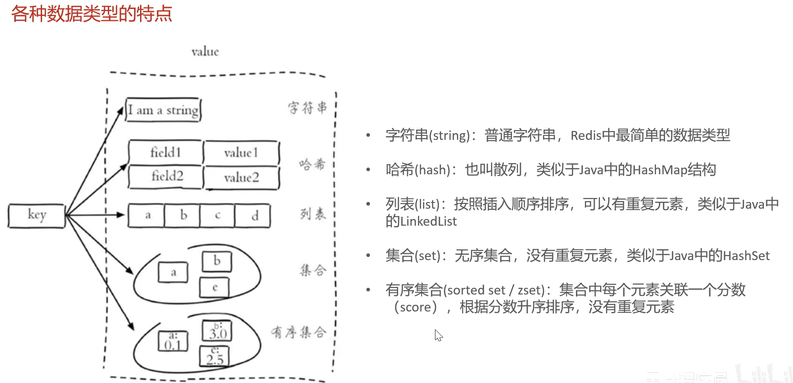

# Redis

基于内存 以 key-value 结构存储的数据库

基于内存存储 读写性能高

适合存储热点数据

https://redis.io

## radis 下载与安装

```
radis-server.exe redis.windows.conf
radis-cli.exe -h localhost -p 6379 -a root
```

### 数据类型

```
string
hash
list
set
zset / sorted set
```


